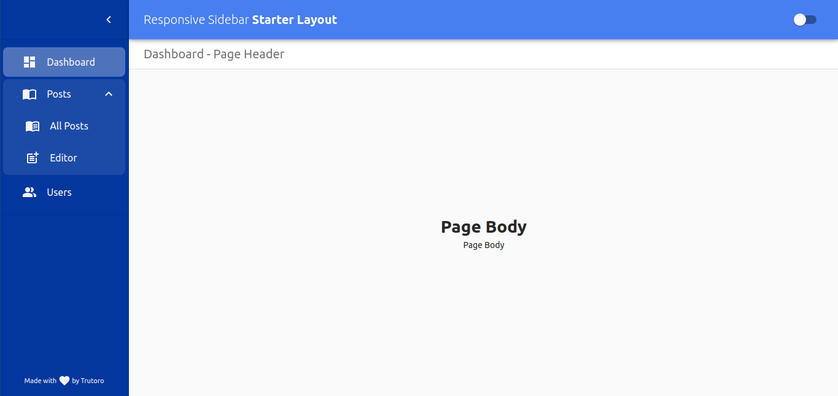
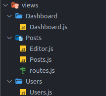

# react-material-sidebar

Basic React responsive sidebar starter template built on top of [Material UI](https://material-ui.com).

Click here for <a href="https://demo.pnath.in" target="_blank">live demo</a>.



## Installation

```
git clone https://github.com/trutoro/react-material-sidebar-starter.git
cd react-material-sidebar-starter
```

Run the packages installation and the server

```
npm install
npm start
```

## Basic customization

### Adding navigation button

Customize navigation button by adding url in `src/data/navigationData.js`, e.g.

```javascript
export const mainNavigation = [
  {
    name: "GC",
    icon: Dashboard,
    url: "/GC",
  },
  // {
  //   name: "Invoice",
  //   icon: ImportContacts,
  //   url: "/Invoice",
  //   navigationData: [
  //     {
  //       name: "All Invoice",
  //       icon: MenuBook,
  //       url: "/Invoice/all",
  //     },
  //     {
  //       name: "Invoiceadd",
  //       icon: PostAdd,
  //       url: "/Invoice/Invoiceadd",
  //     },
  //   ],
  // },
  {
    name: "Invoice",
    icon: ImportContacts,
    url: "/invoice",
  },
];
```

### Adding navigation routes data

Add the routes path data in `src/data/routesData.js`, by following the folder structure in `src/views` directory, e.g.,



```javascript
export const mainRoutes = [
  {
    path: "/GC",
    component: lazy(() => importView(["Dashboard", 2])),
  },
  {
    path: "/Invoice",
    component: lazy(() => importView("Invoice", "routes")),
    routes: [
      {
        path: "/Invoice/all",
        component: lazy(() => importView("Invoice", "Invoice")),
      },
      {
        path: "/Invoice/Invoiceadd",
        component: lazy(() => importView("Invoice", "Invoiceadd")),
      },
    ],
  },
  {
    path: "/invoice",
    component: lazy(() => importView(["Invoice", 2])),
  },
];
```
